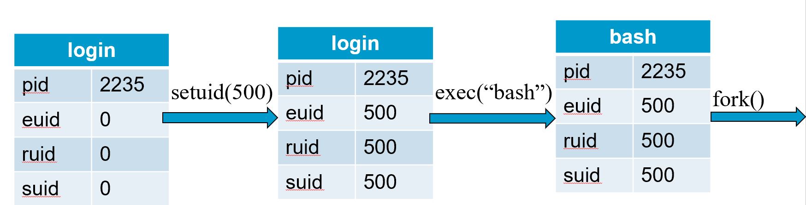
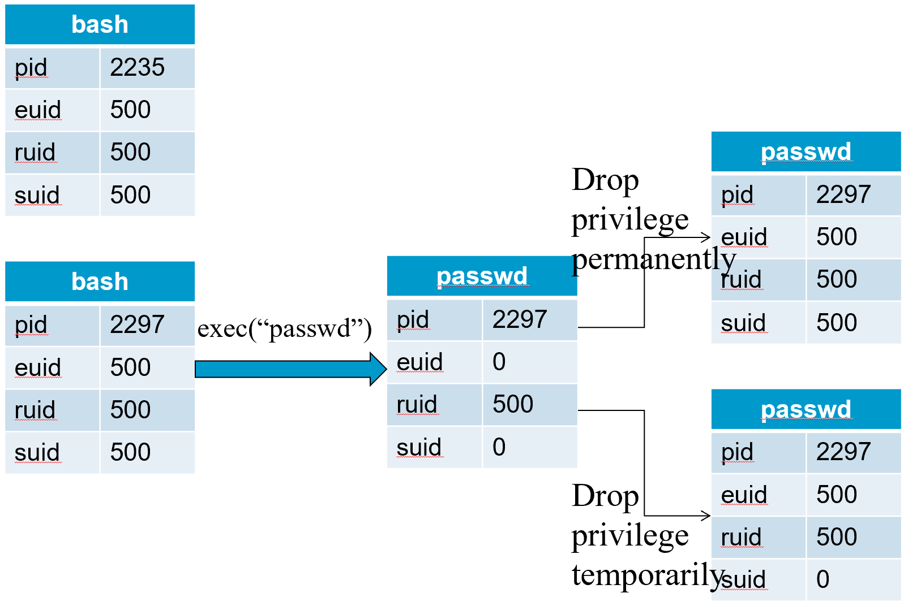

# Operating Systems Security Basics & Unix Access Control

:::warning
Operating Systems Security Basics (from slide01 to slide15) is omitted.
:::

## Access control

- A **reference monitor mediates** all access to resources
    - **Principle: Complete mediation**: control **all** accesses to resources

## ACCESS MATRIX MODEL

- Basic Abstractions
    - Subjects
    - Objects
    - Rights
- The rights in a cell specify the access of the subject (row) to the object (column)

### PRINCIPALS AND SUBJECTS

- A subject is a program (application) executing on behalf of some principal(s)
- A principal may at any time be idle, or have one or more subjects executing on its behalf

*What are subjects in UNIX?*

*What are principals in UNIX?*

### OBJECTS

- An object is anything on which a subject can perform operations (mediated by rights)
- Usually objects are passive, for example:
    - File
    - Directory (or Folder)
    - Memory segment
- But, subjects (i.e. processes) can also be objects, with operations performed on them
    - kill, suspend, resume, send interprocess communication, etc.

## Basic Concepts of UNIX Access Control: Users, Groups, Files, Processes

- Each user account has a unique UID
    - The UID 0 means the super user (system admin)
- A user account belongs to multiple groups
- Subjects are processes
    - associated with uid/gid pairs, e.g., (euid, egid), (ruid, rgid), (suid, sgid)
- Objects are files

### USERS AND PRINCIPALS

The system authenticates the human user to a particular principal.

- There should be a one-to-many mapping from users to principals
    - a user may have many principals, but
    - each principal is associated with an unique user
- This ensures accountability of a user's actions

*What does the above imply in UNIX?*

### Organization of Objects

- In UNIX, almost all objects are modeled as files
    - Files are arranged in a hierarchy
    - Files exist in directories 
    - Directories are also one kind of files
- Each object has
    - owner
    - group
    - 12 permission bits
    - rwx for owner, rwx for group, and rwx for others
    - suid, sgid, sticky

### UNIX inodes

Each file corresponds to an inode

### UNIX Directories

### Basic Permissions Bits on Files (Non-directories)

- Read controls reading the content of a file
    - i.e., the read system call

- Write controls changing the content of a file
    - i.e., the write system call

- Execute controls loading the file in memory and execute
    - i.e., the execve system call

### Execution of a file

- Binary file vs. script file
- Having execute but not read, can one run a binary file?
    - Yes.
- Having execute but not read, can one run a script file?
    - No.
- Having read but not execute, can one run a script file?
    - Yes, by invoking the interpreter 

### Permission Bits on Directories

- Read bit allows one to show file names in a directory 
- The execution bit controls traversing a directory
    - does a lookup, allows one to find inode # from file name
    - chdir to a directory requires execution
- Write + execution control creating/deleting files in the directory
    - Deleting a file under a directory requires no permission on the file
- Accessing a file identified by a path name requires execution to all directories along the path 

### The suid, sgid, sticky bits

### Some Examples

- What permissions are needed to access a file/directory?
    - read a file:  		`/d1/d2/f3`
    - write a file:			`/d1/d2/f3`
    - delete a file:		`/d1/d2/f3`
    - rename a file:		from `/d1/d2/f3` to `/d1/d2/f4`
…
- File/Directory Access Control is by System Calls
    - e.g., open(2), stat(2), read(2), write(2), chmod(2), opendir(2), readdir(2), readlink(2), chdir(2), …

### The Three Sets of Permission Bits

- Intuition:
    - if the user is the owner of a file, then the r/w/x bits for owner apply
    - otherwise, if the user belongs to the group the file belongs to, then the r/w/x bits for group apply
    - otherwise, the r/w/x bits for others apply 

:::details
*Can one implement negative authorization, i.e., only members of a particular group are not allowed to access a file?*
:::

### Other Issues On Objects in UNIX

- Accesses other than read/write/execute
    - Who can change the permission bits?
        - The owner can 
    - Who can change the owner?
        - Only the superuser
- Rights not related to a file
    - Affecting another process
    - Operations such as shutting down the system, mounting a new file system, listening on a low port
        - traditionally reserved for the root user

## Security Principles Related to Access Control

- Psychological acceptability is related to configuring access control policies.
- Fail-safe defaults
- Least privilege
- Complete mediation

### Principle of Fail-safe defaults

- Base access decisions on permission rather than exclusion. This principle[...] means that the default situation is lack of access, and the protection scheme identifies conditions under which access is permitted. The alternative, in which mechanisms attempt to identify conditions under which access should be refused, presents the wrong psychological base for secure system design. A conservative design must be based on arguments why objects should be accessible, rather than why they should not.
- E.g., whitelisting instead of black listing.

:::details
In a large system some objects will be inadequately considered, so a default of lack of permission is safer. A design or implementation mistake in a mechanism that gives explicit permission tends to fail by refusing permission, a safe situation, since it will be quickly detected. On the other hand, a design or implementation mistake in a mechanism that explicitly excludes access tends to fail by allowing access, a failure which may go unnoticed in normal use. This principle applies both to the outward appearance of the protection mechanism and to its underlying implementation.
:::

### Principle of Least Privilege

- Every program and every user of the system should operate using the least set of privileges necessary to complete the job. Primarily, this principle limits the damage that can result from an accident or error. It also reduces the number of potential interactions among privileged programs to the minimum for correct operation, so that unintentional, unwanted, or improper uses of privilege are less likely to occur. [...]  The military security rule of "need-to-know" is an example of this principle.

### Principle of Complete mediation

- Every access to every object must be checked for authority. This principle, when systematically applied, is the primary underpinning of the protection system. It forces a system-wide view of access control, which in addition to normal operation includes initialization, recovery, shutdown, and maintenance. It implies that a foolproof method of identifying the source of every request must be devised. It also requires that proposals to gain performance by remembering the result of an authority check be examined skeptically. If a change in authority occurs, such remembered results must be systematically updated.

## Subjects vs. Principals

- Access rights are specified for user accounts (principals).
- Accesses are performed by processes (subjects)
- The OS needs to know on which user accounts’ behalf a process is executing
- *How is this done in Unix?*

## Process User ID Model in Modern UNIX Systems

- Each process has three user IDs
    - real user ID (ruid)       owner of the process
    - effective user ID (euid)  used in most access control decisions
    - saved user ID (suid)		
- and three group IDs
    - real group ID
    - effective group ID
    - saved group ID
- When a process is created by fork
    - it inherits all three users IDs from its parent process
- When a process executes a file by exec
    - it keeps its three user IDs unless the set-user-ID bit of the file is set, in which case the effective uid and saved uid are assigned the user ID of the owner of the file
- A process may change the user ids via system calls

### The Need for suid/sgid Bits

- Some operations are not modeled as files and require user id = 0
    - halting the system
    - bind/listen on “privileged ports” (TCP/UDP ports below 1024)
    - non-root users need these privileges
- File level access control is not fine-grained enough 
- System integrity requires more than controlling who can write, but also how it is written

### Security Problems of Programs with suid/sgid

- These programs are typically setuid root
- Violates the least privilege principle
    - every program and every user should operate using the least privilege necessary to complete the job
- Why violating least privilege is bad?
- How would an attacker exploit this problem?
- How to solve this problem?

#### Changing effective user IDs

- A process that executes a set-uid program can drop its privilege; it can
    - drop privilege permanently
        - removes the privileged user id from all three user IDs
    - drop privilege temporarily
        - removes the privileged user ID from its effective uid but stores it in its saved uid, later the process may restore privilege by restoring privileged user ID in its effective uid

#### What Happens during Logging in

- After the login process verifies that the entered password is correct, it issues a setuid system call.

- The login process then loads the shell, giving the user a login shell.

- The user types in the passwd command to change his password.

- The fork call creates a new process, which loads “passwd”, which is owned by root user, and has setuid bit set.

## Mechanism versus Policy

- “Separation of mechanism and policy” as a design principle
    - Roughly, implements a mechanism that is flexible and can be configured to support different policies, instead of hardcoding the policy in the implementation.
    - Delay decisions as much as possible, leave decisions to users
- Examples:
    - “Mechanism, not policy” made explicit initially by the designers of X windowing system
        - X provide primitives, and Interface and look-and-feel up to application level
    - UNIX’s philosophy in general, simple flexible tools 
    - Linux security module as another example

### Case Against “Mechanism, no Policy”

- Eric Steven Raymond in The Art of Unix Programming, the “What Unix Gets Wrong” section
    - “But the cost of the mechanism-not-policy approach is that when the user can set policy, the user must set policy. Nontechnical end-users frequently find Unix's profusion of options and interface styles overwhelming and retreat to systems that at least pretend to offer them simplicity.”
    - “In the short term, Unix's laissez-faire approach may lose it a good many nontechnical users. In the long term, however, it may turn out that this ‘mistake’ confers a critical advantage — because policy tends to have a short lifetime, mechanism a long one.  So the flip side of the flip side is that the “mechanism, not policy” philosophy may enable Unix to renew its relevance long after competitors more tied to one set of policy or interface choices have faded from view.”

:::details
So the flip side of the flip side is that the “mechanism, not policy” philosophy may enable Unix to renew its relevance long after competitors more tied to one set of policy or interface choices have faded from view
:::

### Case Against “Mechanism, no Policy”, My View

- Especially problematic for security.
    - “A security mechanism that is very flexible and can be extensively configured is not just overwhelming for end users, it is also highly error-prone. While there are right ways to configure the mechanism to enforce some desirable security policies, there are often many more incorrect ways to configure a system.  And the complexity often overwhelms users so that the mechanism is simply not enabled.  […]   While a mechanism is absolutely necessary for implementing a protection system, having only a low-level mechanism is not enough.”
    - In Li et al. “Usable Mandatory Integrity Protection for Operating Systems”, IEEE SSP 2007.

For security, needs to provide right tradeoff of flexibility versus rigitity.

### A Case Study of “Mechanism vs. Policy” in UNIX Access Control

- The policy: a process that executes a set-uid program can drop its privilege; it can
    - drop privilege permanently
    - drop privilege temporarily
- The mechanism: setuid system calls

“Setuid Demystified”, In USENIX Security ‘ 02

## Access Control in Early UNIX 

- A process has two user IDs: real uid and effective uid and one system call setuid
- The system call setuid(id)
    - when euid is 0, setuid set both the ruid and the euid to the parameter
    - otherwise, the setuid could only set effective uid to real uid
        - Permanently drops privileges
- A process cannot temporarily drop privilege

:::details
*Why need setuid program?*
:::

### System V

- To enable temporarily drop privilege, added saved uid & a new system call 
- The system call seteuid
    - if euid is 0, seteuid could set euid to any user ID
    - otherwise, could set euid to ruid or suid
        - Setting euid to ruid temp. drops privilege
- The system call setuid is also changed
    - if euid is 0, setuid functions as seteuid
    - otherwise, setuid sets all three user IDs to real uid

### BSD

- Uses ruid & euid, change the system call from setuid to setreuid
    - if euid is 0, then the ruid and euid could be set to any user ID
    - otherwise, either the ruid or the euid could be set to value of the other one
        - enables a process to swap ruid & euid

## Modern UNIX

- System V & BSD affect each other, both implemented setuid, seteuid, setreuid, with different semantics
    - some modern UNIX introduced setresuid
- Things get messy, complicated, inconsistent, and buggy
    - POSIX standard, Solaris, FreeBSD, Linux

### Suggested Improved API

- Three method calls
    - drop_priv_temp
    - drop_priv_perm
    - restore_priv
- Lessons from this? 
    - “Mechanism, not policy” not necessarily a good idea for security (flexibility not always a good thing)
    - Psychological acceptability principle
        - “human interface should be designed for ease of use” 
        - the user’s mental image of his protection goals should match the mechanism
