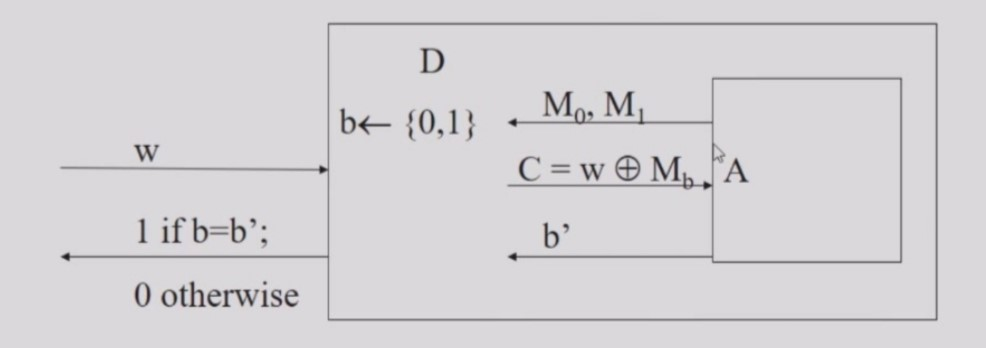
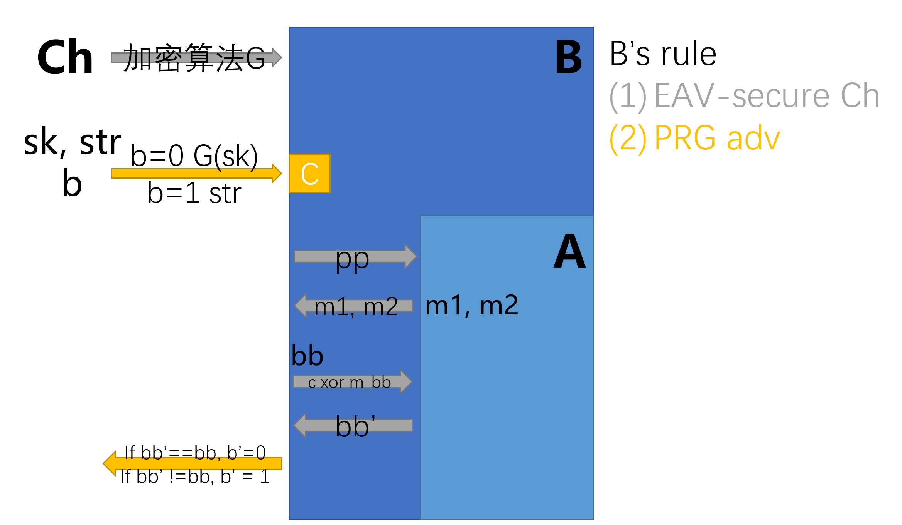

# Cryptography - One-time Pad, Information Theoretic Security, and Stream Ciphers

:::warning
One-time Pad和数学基础的部分（从英文幻灯片的第1页至第16页，第22至第24页）被略过了。
:::

## 信息论安全性 (Information-Theoretic (Shannon) Security) = 完善保密性 (Perfect Secrecy)

:::warning
完善保密性(perfect secrecy)是信息论安全性的一个特例，为香农提出的信息学观点，具有该性质的密文不应该透露任何明文的信息。达成这项性质的方法是使用与明文空间相等或更大的密钥空间。
[完善保密性 - wikipedia](https://zh.wikipedia.org/wiki/%E5%AE%8C%E5%96%84%E4%BF%9D%E5%AF%86%E6%80%A7)
:::

- 基本思想：密文不应透露关于明文的任何“信息”。

**[定义]** 一个密码系统在信息空间(Message space)$M$上的加密是具有完善保密性(Perfect Secrecy)的，如果：

对于$M$上的所有概率分布

对于任意一个在空间$M$上的信息$m$

对于任意一个在密文空间$C$上，满足$Pr[C=c] > 0$的密文$c$

均有 $Pr[PT=m|CT=c]  =  Pr[PT=m]$

###  定义中的参数

- $Pr[PT=m]$是攻击者/对手(adversary)在看到密文之前认为明文是$m$的概率。
- $Pr[PT=m|CT=c]$是对手知道密文$c$后，认为明文是$m$的概率。
- Pr[PT=m|CT=c] = Pr[PT=m]$代表着攻击者知道密文是$c$之后，他对明文是什么的看法并没有改变。

### 对完善保密性的一个等价定义

**[定义]** 一个加密方案是具有完善保密性的，当且仅当**对于任何密文$c$，以及任意的两个明文$m_1$和$m_2$，$m_1$被加密为$c$的概率与$m_2$被加密为$c$的概率相同**。

数学表述为：

$\forall$message $m1$, $m2$

$\forall$ciphertext $c$

$Pr[CT=c|PT=m1] = Pr[CT=c|PT=m2]$

### 另一个对完善保密性的等价定义

如果对$M$上任意的概率分布，随机变量$PT$and $CT$是独立的，则一个定义在信息空间$M$上的加密方案是具有完善保密性的，也即：

$\forall$message $m\in M$

$\forall$ciphertext $c\in C$

$Pr[PT=m\wedge CT=c]  =  Pr[PT=m] \cdot Pr[CT = c]$

注意到这等价于：当$Pr[CT=c] \neq 0$时，有：

$Pr[PT=m] = Pr [PT=m\wedge CT=c] / Pr[CT=c] = Pr[PT=m|CT=c]$

这也等价于：当$Pr[PT=m] \neq 0$时, 有：

$Pr[CT=c] = Pr[PT=m\wedge CT=c] / Pr[PT=m] = Pr[CT=c|PT=m]$

### 信息论安全性的一个例子

- 考虑对一个六面骰子（点数为1-6）的投掷结果进行加密。
    - 方法1：随机生成K=[1...6]，将骰子的读数+K作为密文。
        - 问题：明文的分布是什么？
        - 问题：在看到密文为3后，明文可能是什么；在看到密文为12后，明文可能是什么？
    - 方法2：随机生成K=[1...6]，将骰子的读数+K，然后对6取模作为密文。
        - 考虑方法1中的两个问题。
        - 是否可以用暴力攻击的方法破解加密？

### 完善保密性 (Perfect Secrecy)

- 当密码中的密钥被均匀地选择时，该密码具有完善保密性，当且仅当对任何(M,C)来说，将M加密到C的密钥数量是相同的。
    - 这意味着$\forall c \forall m_1 \forall m_2 Pr[CT=c|PT=m1] = Pr[CT=c|PT=m2]$
- 当限制信息长度为定长时，一次性密码本(One-time pad)有完善保密性（证明？）

### 完善保密性的“坏消息”定理 （The "Bad News" Theorem）

- 问题：在一次性密码本中，要求密钥和信息一样长是否是实现完善保密性的内在要求？
- 答案：是的，完善保密性意味着密钥的长度大于等于信息的长度。
- 这意味着在实践中，采用一次性密码本的加密方法难以实现完善保密性。

证明如下：

:::details

考虑到密文$C_0$，对于明文空间中的任意明文$M$，必须存在至少一个密钥，在这个密钥的作用下密文$C_0$可以被解密为$M$。此外，对于明文空间中任意的两个明文，它们所对应的密钥必须不同（否则人们无法唯一地解密密文）。因此，密钥的数量必须至少与明文的数量一样大。

问题：考虑明文空间、密文空间和密钥空间，对于任何加密系统，它们的大小必须满足什么关系？对于一个满足完善保密性的系统来说，它们的大小必须满足什么关系？
:::

## 流密码 (Stream Ciphers)

- 在一次性密码本中，密钥是一个随机字符串，其长度至少与信息相同。
- 流密码：
    - 基本思想：用“伪随机数”取代“随机数”。
    - 使用伪随机数生成器(Pseudo Random Number Generator, abbr. PRG or PRNG)
    - PRNG：$\{0, 1\}_^{s} \rightarrow \{ 0, 1 \}^{n}$
        - 伪随机数生成器将一个短的（如128 bit）随机种子扩展成一个较长的（如106位）、并且“看起来很随机的”字符串
    - 密钥就是种子
    - 基本加密方法：$E_{key}[M] = M \oplus PRNG(key)$，其中$\oplus$为按位的异或运算。

### 伪随机数生成器 (Pseudo Random Number Generator)

- 适用于密码学、仿真、随机算法等。
    - 例如：流密码，生成会话密钥
- 相同的种子总是给出相同的输出流 
    - 问题：为什么这对流密码来说是必要的？
- 仿真需要均匀分布的序列
    - 例如，具有一些统计学特性
- **在密码学意义上安全的(Cryptographically secure)伪随机数生成器**需要不可预测的序列
    - 能够通过“下一比特测试(next-bit test)”：给定输出的连续比特序列（但不是种子），下一比特必须难以预测
- 然而，有一些伪随机数生成器很弱：如果攻击者能够得到足够长度的输出序列，他可以通过这个输出序列来得到密钥。 
    - 不要将这些伪随机数生成器用于加密目的

### 随机性和伪随机性 

- 对于一个良好的流密码，它需要是“伪随机”。
- 随机性不是一个字符串的属性
    - `000000`比`011001`更“不随机”吗？
    - 随机性是一种分布的属性，或者是从分布中抽取的随机变量的属性 
- 相似的，伪随机也是一个分布的属性
- 我们认为“I-长”字符串空间（即空间中每一个元素均是长度为$I$的字符串）上的分布$D$是伪随机的，如果它与随机分布**无法区分(indistinguishable)**。
- 我们使用“随机字符串(random string)”和“伪随机字符串(pseudorandom string)”简称满足上面条件的字符串。

### 区分器 (Distinguisher) 

- 工作在两个分布上的区分器$D$的工作方式如下：给予$D$一个从两个分布中采样的字符串，$D$试图猜测它来自哪个分布，如果$D$猜对了，那我们称$D$成功了。

### 伪随机数生成器的定义

**[定义3.14]** 如果一个在输入长度为$n$时，输出一个长度为$l(n)$的字符串的算法$G$满足：

1. 对于每个$n$，均有$l(n)\ge n$。
2. 对于每个区分器$D$（原文：For each PPT distinguisher $D$，PPT是指...？），均存在一个可忽略的函数$negl$，使得$| Pr[D(r)] = 1 — Pr[D(G(s))=1] | \leq negl(n)$（其中$r$从$\{ 0, 1\}_^{l(n)}$中均匀地随机选择，$s$从$\{ 0, 1 \}^{n}$中均匀地随机选择。

则我们称算法$G$是一个伪随机发生器。 

### 使用流密码进行加密的安全性

考虑构造加密$\Pi$，以及对$m$的加密$G(k) \oplus m$。

**[定理3.16]** 如果$G$是一个伪随机生成器，那么$\Pi$在有窃听者(EAVesdropper)的情况下有不可区分的加密(indistinguishable encryption)。

对定理3.16的证明如下：

如果$\Pi$在有窃听者的情况下不存在不可区分的加密，那么存在攻击者A，可以以不可忽略的概率$O(\epsilon)$破解$\Pi$。我们构建一个区分器D如下：



:::details
**[定理]** $G(k) \oplus m$是防窃听(EAV-secure)的，如果$G$是一个伪随机数生成器。

- **EAV-secure**（防窃听）: 攻击者A任意挑选两条不同的信息$m_0, m_1$（可以挑选无限次）作为明文提供给裁判机，裁判机选取其中的随机位$b$，将使用密钥$sk$加密得到密文$Enc_{sk}(m_b)$中的第$b$位，返回给攻击者A，攻击者需要猜测位数$b$。如果攻击者能够猜测正确$b$，那么这个加密算法是不防窃听的。即破解者始终能够破解其中的某几位。
    ```
    +----+     pp      +---+
    | Ch | ----------> | A |
    +----+    m0, m1   +---+
      sk   <---------- m0, m1
       b   Enc(sk,m_b)     
           ---------->
                b'
           <----------
    ```
    - 在上面的示意图中，Ch指裁判机，它会裁判A的破解答案，并判断A是否成功破解这个加密算法。pp指公共参数(Public Parameter)，它是一组已知的值或变量，并在加密系统的参与者之间公开共享，这些参数通常包括公钥、系统参数或其他加密算法运行所需的变量等值，在这里可以理解为加密算法。
    - 可以从[这个链接（CS555，Lecture20，Spring17，PU）](https://www.cs.purdue.edu/homes/jblocki/courses/555_Spring17/slides/Lecture20.pdf)获得更多信息。

**反证** 如果存在一个攻击A能够破坏$G(k) \oplus m$的防窃听，那么我们就可以构造一种攻击B（一种规约），它能够破坏伪随机数生成器$G$的伪随机性。



**证明** 攻击A持有$\epsilon$的概率（不收敛至0）破坏$G(k) \oplus m$的防窃听，那么根据上图构造的攻击B打破伪随机数生成器$G$的伪随机性的概率是

$$\begin{array}{ll}
    Pr[B wins] & = Pr[B wins | b = 0] \cdot Pr[b = 0] + Pr[B wins | b = 1] \cdot Pr[b = 1] \\
    & = Pr[B wins | b = 0] \cdot 0.5 + Pr[B wins | b = 1] \cdot 0.5 \\
    & = Pr[b^{\prime} = 0| b = 0] \cdot 0.5 + Pr[b^{\prime} = 1 | b = 1] \cdot 0.5 \\
    & \geq (0.5 + \epsilon) \cdot 0.5 + 0.5 \cdot 0.5 \\
    & = 0.5 + 0.5 \cdot \epsilon
\end{array}$$
:::

### 流密码的特性

- 典型的流密码运行速度非常快
- 被广泛使用，但在应用中进程存在漏洞
    - 内容扰乱系统，一种加密光盘盘片的方式：错误地使用线性反馈移位寄存器(Linear Feedback Shift Registers) 
    - 有线等效加密(Wired Equivalent Privacy, abbr. WEP)，又称无线加密协议(Wireless Encryption Protocol, abbr. WEP)：错误地使用了RC4
    - SSL：使用RC4的SSLv3没有已知的重大缺陷

### 流密码的安全性质

- 在已知明文、选择的明文或选择的密文的情况下，攻击者知道密钥流（即$PRNG(key)$）。
    - 安全性取决于$PRNG$
    - $PRNG$必须是“不可预测的(unpredictable)”
- 问题：流密码有完善保密性吗？
- 问题：如何以暴力方式破解流密码？
- 如果同一个密钥流被使用两次，那么流密码很容易被破解。
    - 这是流密码的一个基本弱点，即便在流密码中使用的PRNG很强，仍然存在这个问题。

### 流密码的应用方式

- 如果同一个密钥流被使用两次，那么流密码很容易被破解。
    - 这是流密码的一个基本弱点，即便在流密码中使用的PRNG很强，仍然存在这个问题。
- 在实际应用中，同一个密钥被用来加密许多信息 
    - 例如在无线通信领域中
    - 解决方案：使用初始化向量(Initial vectors , abbr. IV)。
    - $E_key[M] = [IV, M \oplus PRNG(key || IV)]$
        - IV以明文的方式发送给接收方
        - IV需要完整性保护(integrity protection)，但不需要保密性保护(confidentiality protection)
        - IV能够确保加密时采用的密钥流不重复，但它不能不增加暴力攻击的成本
        - 在知道IV的情况下，如果没有密钥，密文仍然不能被解密
    - 需要确保IV永不重复
