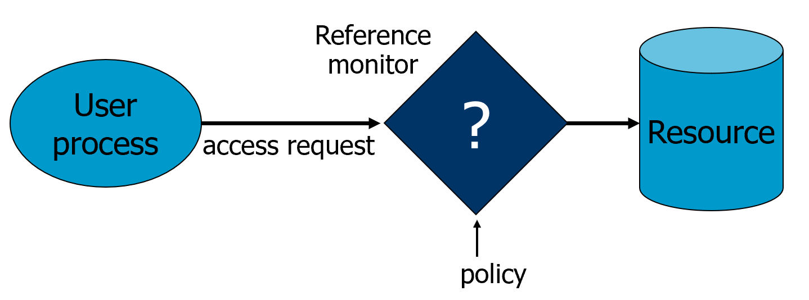

# Operating Systems Security Basics & Unix Access Control

:::warning
第一部分（Operating Systems Security Basics，从英文幻灯片的第1页至第15页）被略过了。
:::

## 访问控制 (Access control)

- **引用监视器(reference monitor)** 仲裁(mediate)对所有资源的访问。
    - 原则：**完全仲裁原则(complete mediation)**: 控制**所有**资源的访问操作请求

## 访问控制矩阵模型 (Access matrix model)

- 基本抽象概念
    - 主体(Subject)
    - 受体(Object)
    - 权限(Right)
- 矩阵中每一个元胞中的权限域规定了主体（矩阵的行）对受体（矩阵的列）的访问。

### 委托人(Principal)与主体(subject)

- 主体是代表某些委托人执行的应用程序
- 一个委托人在任何时候都可能是空闲的，或者有一个或多个主体在代表它执行任务。

*问题：什么是UNIX中的主体？*

*问题：什么是UNIX中的委托人？*

### 客体(object)

- 一个客体是主体可以对其进行操作的任何东西（以主体的权限为中介）。
- 通常而言，客体在访问的过程中是被动的。客体的几个例子：
    - 文件
    - 目录（或文件夹）
    - 内存中的段
- 但是，主体（即进程）也可以是客体，可以对其进行操作
    - 杀死、暂停、恢复进程、发送进程间通信等。

## UNIX访问控制的基本概念：用户(User)、组(Groups)、文件(Files)和进程(Processes)

- 每个用户账户都有一个唯一的UID
    - UID 0表示超级用户（系统管理员）。
- 一个用户帐户可以属于一个或多个组
- 访问控制中的主体是进程
    - 进程与`pair<uid,gid>`相关联，例如：(euid, egid), (ruid, rgid), (suid, sgid)。
- 访问控制中的客体是文件

### 用户(Users)和委托人(Principals)

系统将人类用户认证成为一个特定的委托人。

- 从用户到委托人之间存在一个一对多的映射关系
    - 一个用户可以有很多委托人，但是
    - 每个委托人都与一个唯一的用户相关联
- 这确保了对用户行为的问责

* 问题：上述内容在UNIX中意味着什么？*

### 客体的构成

- 在UNIX中，几乎所有的对象都被建模为文件(file)
    - 文件被安排在一个层次结构(hierarchy)中
    - 文件存在于目录(directory)中
    - 目录也是文件的一种
- 每个客体都有
    - 所有者
    - 组
    - 12个权限位
    - 一组rwx代表所有者的权限，一组rwx代表组的权限，一组rwx代表其他用户的权限。
    - suid, sgid, sticky

### UNIX中的inode

每个文件都对应于一个inode，inode指示了文件在磁盘上具体位于何处。 在**同一个文件系统**上唯一。

:::tip
- 软链接(Symbolic link)与硬链接(Hard link)
    - 硬链接的文件共享同一个inode
    - 软链接的文件通过软链接者的inode查找磁盘，找到源文件的路径
:::

### UNIX中的目录

### 非目录文件的基本权限位

- r控制了对文件内容的读
    - 例如, `read`系统调用

- w控制了对文件内容的修改
    - 例如, `write`系统调用

- Execute controls loading the file in memory and execute
- x控制了文件被加载到内存中并执行的权限
    - 例如，`execve`系统调用

### 文件的执行

- 二进制文件(Binary file)与脚本文件(script file)的对比
- 有执行但无读权限，能否运行一个二进制文件？
    - 可以。
- 有执行但无读权限，能否运行一个脚本文件？
    - 不可以。
- 有读但无执行权限，能否运行一个脚本文件？
    - 可以，通过调用脚本文件的解释器(interpreter)

### 目录文件的权限位

- 读取权限允许人们显示一个目录中的文件名 
- 执行权限控制目录的遍历
    - 允许人们在目录中查找，从文件名中找到inode#。
    - `chdir`/`cd`一个目录需要对这个目录的执行权限
- 写入以及执行权限控制在目录中创建或删除文件
    - 删除一个目录下的文件，不需要对**该文件**有任何权限
- 访问一个由路径名称确定的文件需要在该路径上的所有目录的执行权限

### suid, sgid, sticky位

:::tip
**Q**: 在UNIX访问控制中，suid, sgid, sticky位是什么？euid和egid呢？

**A**(*由AI生成*)：在基于UNIX的系统中，suid、sgid和sticky位是特殊的权限位，可以设置在可执行文件或目录上以控制访问和权限。此外，euid和egid是与UNIX系统中的用户和组身份有关的概念。让我们更详细地探讨一下这些概念：

SUID(Set User ID)： 当可执行文件上的SUID位被设置时，它允许文件以文件所有者的权限而不是执行它的用户的权限被执行。这对于授予某些用户临时提升的权限以完成特定任务特别有用。例如，passwd命令需要以高权限执行来修改密码文件，所以它设置了SUID位。

SGID(Set Group ID)： 与SUID类似，SGID位允许可执行文件以组所有者的权限而不是执行它的用户的权限执行。当SGID位被设置在一个目录上时，在其中创建的新文件或目录会继承父目录的组所有权(ownership)。这在多个用户需要在一个共享目录中协作处理文件的情况下是很有帮助的。

sticky：sticky位，在一个目录的权限字段中用“t”或“T”表示，主要用于目录。当sticky位被设置时，只有该目录中文件的所有者或root用户可以删除或重命名该文件。它通常被设置在可由多个用户写入的目录上，如`/tmp`目录，以防止其他用户未经授权删除或修改文件。

EUID(Effective User ID)： EUID代表在UNIX系统上运行的一个进程的有效用户ID。它是一个运行时属性，决定了一个进程在与各种系统资源交互时的权限和访问权。EUID可以与真正的用户ID（UID）不同，这取决于进程的执行方式以及可执行文件上是否设置了SUID位。

EGID(Effective Group ID)： 与EUID类似，EGID代表一个进程的有效组ID。它决定了一个进程在与系统资源交互时的组权限和访问权。像EUID一样，EGID可以基于各种因素与真正的组ID（GID）不同。

这些概念对于理解和管理基于UNIX的系统中的访问控制至关重要，允许对权限和用户/组身份进行细粒度的控制。
:::

### 例子

- 访问以下文件/目录需要什么权限？
    - 读文件：              `/d1/d2/f3`
    - 写文件：              `/d1/d2/f3`
    - 删除文件：    		`/d1/d2/f3`
    - 重命名文件：		    从 `/d1/d2/f3` 到 `/d1/d2/f4`

- 文件/目录的访问控制通过系统调用实现
    - 例如：open(2), stat(2), read(2), write(2), chmod(2), opendir(2), readdir(2), readlink(2), chdir(2), …

### 三组权限位

- 直觉上：
    - 如果用户是一个文件的所有者，那么所有者的r/w/x位适用
    - 否则，如果用户属于该文件所属的组，则适用组的r/w/x位
    - 否则，其他的r/w/x位适用

:::details
问题：*可以实现负向授权(negative authorization)，即只允许某个特定组的成员不访问某个文件吗？*
:::

### 关于UNIX访问控制中客体的其他问题

- 除了读/写/执行以外的访问权
    - 谁可以改变权限位？
        - 所有者可以 
    - 谁可以改变所有者？
        - 只有超级用户
- 与文件无关的权限(Rights not related to a file)
    - 影响另一个进程
    - 操作，如关闭系统、挂载一个新的文件系统、监听一个低端口
        - 传统上保留给root用户

## Security Principles Related to Access Control

- Psychological acceptability is related to configuring access control policies.
- Fail-safe defaults
- Least privilege
- Complete mediation

## Principle of Fail-safe defaults

- Base access decisions on permission rather than exclusion. This principle[...] means that the default situation is lack of access, and the protection scheme identifies conditions under which access is permitted. The alternative, in which mechanisms attempt to identify conditions under which access should be refused, presents the wrong psychological base for secure system design. A conservative design must be based on arguments why objects should be accessible, rather than why they should not.
- E.g., whitelisting instead of black listing.

:::details
In a large system some objects will be inadequately considered, so a default of lack of permission is safer. A design or implementation mistake in a mechanism that gives explicit permission tends to fail by refusing permission, a safe situation, since it will be quickly detected. On the other hand, a design or implementation mistake in a mechanism that explicitly excludes access tends to fail by allowing access, a failure which may go unnoticed in normal use. This principle applies both to the outward appearance of the protection mechanism and to its underlying implementation.
:::

## Principle of Least Privilege

- Every program and every user of the system should operate using the least set of privileges necessary to complete the job. Primarily, this principle limits the damage that can result from an accident or error. It also reduces the number of potential interactions among privileged programs to the minimum for correct operation, so that unintentional, unwanted, or improper uses of privilege are less likely to occur. [...]  The military security rule of "need-to-know" is an example of this principle.

## Principle of Complete mediation

- Every access to every object must be checked for authority. This principle, when systematically applied, is the primary underpinning of the protection system. It forces a system-wide view of access control, which in addition to normal operation includes initialization, recovery, shutdown, and maintenance. It implies that a foolproof method of identifying the source of every request must be devised. It also requires that proposals to gain performance by remembering the result of an authority check be examined skeptically. If a change in authority occurs, such remembered results must be systematically updated.

## Subjects vs. Principals

- Access rights are specified for user accounts (principals).
- Accesses are performed by processes (subjects)
- The OS needs to know on which user accounts’ behalf a process is executing
- *How is this done in Unix?*

## Process User ID Model in Modern UNIX Systems

- Each process has three user IDs
    - real user ID (ruid)       owner of the process
    - effective user ID (euid)  used in most access control decisions
    - saved user ID (suid)		
- and three group IDs
    - real group ID
    - effective group ID
    - saved group ID
- When a process is created by fork
    - it inherits all three users IDs from its parent process
- When a process executes a file by exec
    - it keeps its three user IDs unless the set-user-ID bit of the file is set, in which case the effective uid and saved uid are assigned the user ID of the owner of the file
- A process may change the user ids via system calls

## The Need for suid/sgid Bits

- Some operations are not modeled as files and require user id = 0
    - halting the system
    - bind/listen on “privileged ports” (TCP/UDP ports below 1024)
    - non-root users need these privileges
- File level access control is not fine-grained enough 
- System integrity requires more than controlling who can write, but also how it is written

## Security Problems of Programs with suid/sgid

- These programs are typically setuid root
- Violates the least privilege principle
    - every program and every user should operate using the least privilege necessary to complete the job
- Why violating least privilege is bad?
- How would an attacker exploit this problem?
- How to solve this problem?

## Changing effective user IDs

- A process that executes a set-uid program can drop its privilege; it can
    - drop privilege permanently
        - removes the privileged user id from all three user IDs
    - drop privilege temporarily
        - removes the privileged user ID from its effective uid but stores it in its saved uid, later the process may restore privilege by restoring privileged user ID in its effective uid

## What Happens during Logging in

- After the login process verifies that the entered password is correct, it issues a setuid system call.

- The login process then loads the shell, giving the user a login shell.

- The user types in the passwd command to change his password.

- The fork call creates a new process, which loads “passwd”, which is owned by root user, and has setuid bit set.

## Mechanism versus Policy

- “Separation of mechanism and policy” as a design principle
    - Roughly, implements a mechanism that is flexible and can be configured to support different policies, instead of hardcoding the policy in the implementation.
    - Delay decisions as much as possible, leave decisions to users
- Examples:
    - “Mechanism, not policy” made explicit initially by the designers of X windowing system
        - X provide primitives, and Interface and look-and-feel up to application level
    - UNIX’s philosophy in general, simple flexible tools 
    - Linux security module as another example

## Case Against “Mechanism, no Policy”

- Eric Steven Raymond in The Art of Unix Programming, the “What Unix Gets Wrong” section
    - “But the cost of the mechanism-not-policy approach is that when the user can set policy, the user must set policy. Nontechnical end-users frequently find Unix's profusion of options and interface styles overwhelming and retreat to systems that at least pretend to offer them simplicity.”
    - “In the short term, Unix's laissez-faire approach may lose it a good many nontechnical users. In the long term, however, it may turn out that this ‘mistake’ confers a critical advantage — because policy tends to have a short lifetime, mechanism a long one.  So the flip side of the flip side is that the “mechanism, not policy” philosophy may enable Unix to renew its relevance long after competitors more tied to one set of policy or interface choices have faded from view.”

:::details
So the flip side of the flip side is that the “mechanism, not policy” philosophy may enable Unix to renew its relevance long after competitors more tied to one set of policy or interface choices have faded from view
:::

### Case Against “Mechanism, no Policy”, My View

- Especially problematic for security.
    - “A security mechanism that is very flexible and can be extensively configured is not just overwhelming for end users, it is also highly error-prone. While there are right ways to configure the mechanism to enforce some desirable security policies, there are often many more incorrect ways to configure a system.  And the complexity often overwhelms users so that the mechanism is simply not enabled.  […]   While a mechanism is absolutely necessary for implementing a protection system, having only a low-level mechanism is not enough.”
    - In Li et al. “Usable Mandatory Integrity Protection for Operating Systems”, IEEE SSP 2007.

For security, needs to provide right tradeoff of flexibility versus rigitity.

## A Case Study of “Mechanism vs. Policy” in UNIX Access Control

- The policy: a process that executes a set-uid program can drop its privilege; it can
    - drop privilege permanently
    - drop privilege temporarily
- The mechanism: setuid system calls

“Setuid Demystified”, In USENIX Security ‘ 02

## Access Control in Early UNIX 

- A process has two user IDs: real uid and effective uid and one system call setuid
- The system call setuid(id)
    - when euid is 0, setuid set both the ruid and the euid to the parameter
    - otherwise, the setuid could only set effective uid to real uid
        - Permanently drops privileges
- A process cannot temporarily drop privilege

:::details
*Why need setuid program?*
:::

## System V

- To enable temporarily drop privilege, added saved uid & a new system call 
- The system call seteuid
    - if euid is 0, seteuid could set euid to any user ID
    - otherwise, could set euid to ruid or suid
        - Setting euid to ruid temp. drops privilege
- The system call setuid is also changed
    - if euid is 0, setuid functions as seteuid
    - otherwise, setuid sets all three user IDs to real uid

## BSD

- Uses ruid & euid, change the system call from setuid to setreuid
    - if euid is 0, then the ruid and euid could be set to any user ID
    - otherwise, either the ruid or the euid could be set to value of the other one
        - enables a process to swap ruid & euid

## Modern UNIX

- System V & BSD affect each other, both implemented setuid, seteuid, setreuid, with different semantics
    - some modern UNIX introduced setresuid
- Things get messy, complicated, inconsistent, and buggy
    - POSIX standard, Solaris, FreeBSD, Linux

## Suggested Improved API

- Three method calls
    - drop_priv_temp
    - drop_priv_perm
    - restore_priv
- Lessons from this? 
    - “Mechanism, not policy” not necessarily a good idea for security (flexibility not always a good thing)
    - Psychological acceptability principle
        - “human interface should be designed for ease of use” 
        - the user’s mental image of his protection goals should match the mechanism

