# 关于自主访问控制(Discretionary Access Control)的分析

## 参考资料

- [自主访问控制 - 维基百科(英文)](https://en.wikipedia.org/wiki/Discretionary_access_control)

## Why Computers are Vulnerable?

- Programs are buggy

- Humans make mistakes

- Access control is not good enough
    - Discretionary Access Control (DAC) used in Unix and Windows assume that programs are not buggy

## Access Control Check

- Given an access request, return an access control decision based on the policy
    - allow / deny

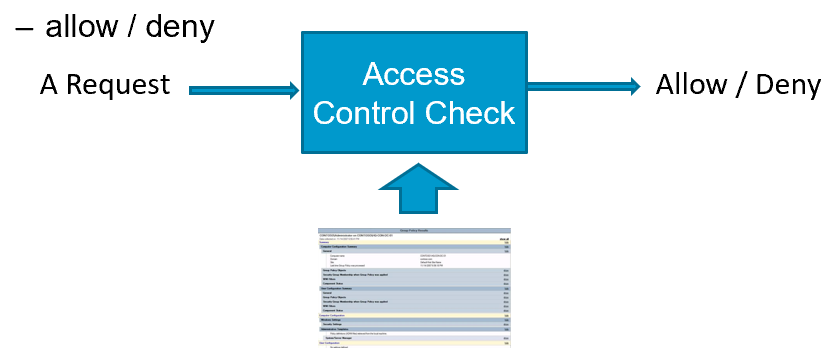

## Discretionary Access Control

- No precise definition.  Basically, DAC allows access rights to be propagated at subject’s discretion
    - often has the notion of owner of an object
    - used in UNIX, Windows, etc.

- According to TCSEC (Trusted Computer System Evaluation Criteria) 
    - "A means of restricting access to objects based on the identity and need-to-know of users and/or groups to which they belong. Controls are discretionary in the sense that a subject with a certain access permission is capable of passing that permission (directly or indirectly) to any other subject." 

:::tip
Owners have discretion to further share. 
:::

## Analysis why DAC is not Good enough

- DAC causes the Confused Deputy problem
    - Solution: use capability-based systems
- DAC does not preseves confidentiality when facing Trojan horses
    - Solution: use Mandatory Access Control (BLP)
- DAC implementation fails to keep track of for which principals a subject (process) is acting on behalf of
    - Solution: fixing the DAC implementation to better keep track of principals

## The Confused Deputy Problem

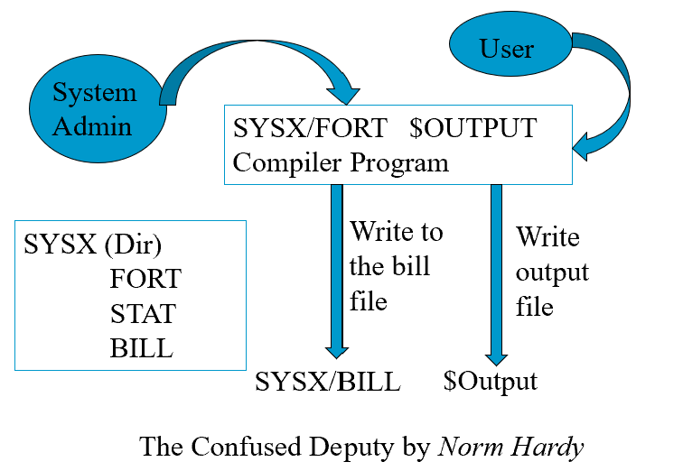

:::tip
The compiler program is SYSX/FORT.
Other files under SYSX include STAT and BILL.
The compiler program needs to write to files in SYSX directory, so it is given authority to write to files in SYSX.
A user who runs SYSX/FORT can provide a file name to receive output info.
A malicious user may use SYSX/BILL as the output name, resulting in billing info being erased.
:::

### Analysis of The Confused Deputy Problem

- The compiler runs with authority from two sources
    - the invoker (i.e., the programmer)
    - the system admin (who installed the compiler and controls billing and other info)
- It is the deputy of two masters
- There is no way to tell which master the deputy is serving when performing a write
- Solution: Use capability

:::tip
How is this problem solved in UNIX access control?
:::

## ACCESS MATRIX MODEL

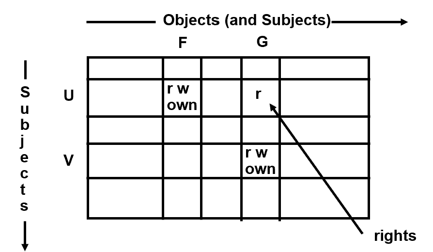

:::tip
This reviews Access Matrices as representation
:::

#### IMPLEMENTATION OF AN ACCESS MATRIX

- Access Control Lists
    - Encode columns
- Capabilities
    - Encode rows
- Access control triples
    - Encode cells

### ACCESS CONTROL LISTS (ACLs)

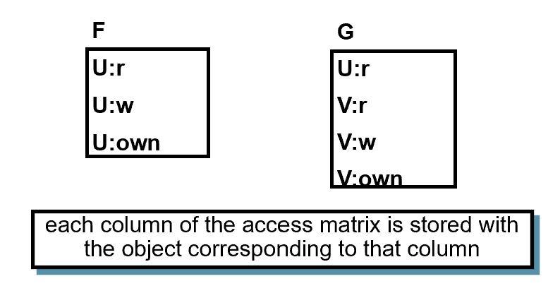

- each column of the access matrix is stored with the object corresponding to that column

### CAPABILITY LISTS

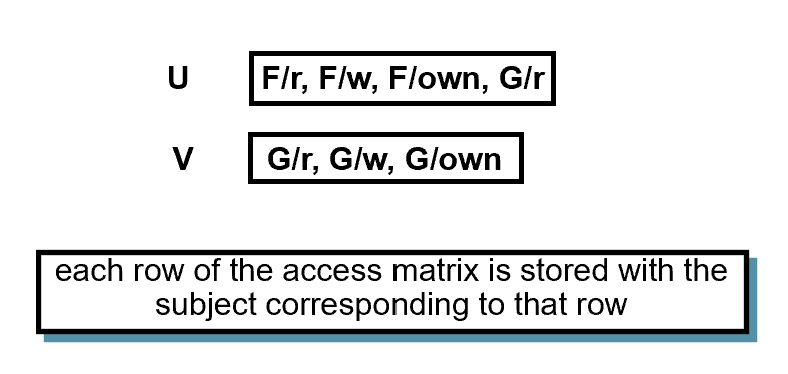

- each row of the access matrix is stored with the subject corresponding to that row

### ACCESS CONTROL TRIPLES

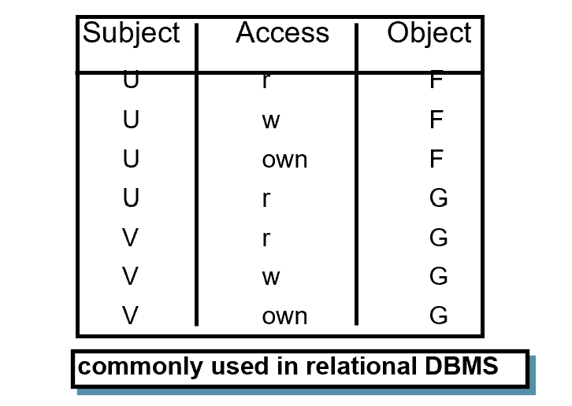

- commonly used in relational DBMS

## Different Notions of Capabilities 

- Capabilities as a row representation of Access Matrices
- Capabilities used in Linux as a way to divide the root power into multiple pieces that can be given out separately
- Capabilities as a way of implementing the whole access control systems
    - Subjects have capabilities, which can be passed around
    - When access resources, subjects select capabilities to access
        - An example is open file descriptors
    - We will examine this last notion in more depth

## More on Capability Based Access Control

- Subjects have capabilities, which
    - Give them accesses to resources
        - E.g., like keys
    - Are transferable and unforgeable tokens of authority
        - Can be passed from one process to another
            - Similar to opened file descriptors
- Why capabilities may solve the confused deputy problems?
    - When access a resource, must select a capability, which also selects a master

:::tip
Example: a secretary works for two faculty members with last name Li, an charges one’s bill to another’s account.  
In ACL, both faculty members authorize the secretary to charge to their accounts.  Confusion may occur.
In Capability-based systems, the secretary is given the rights to charge to the accounts, they came in the forms of tokens.  The secretary when processing one faculty member’s charges, must present the capability, avoiding a confusion.
:::

## How the Capability Approach Solves the Confused Deputy Problem

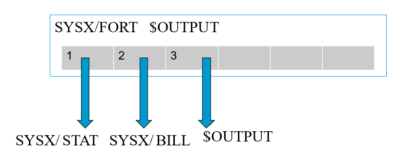

- Invoker must pass in a capability for $OUTPUT, which is stored in slot 3.
- Writing to output uses the capability in slot 3.
- Invoker cannot pass a capability it doesn’t have.

:::tip
The compiler program is given capabilities to access SYSX/STAT and SYSX/BILL, which are stored in capability slots 1 & 2
When the invoker runs the compiler program, it gives a capability to write to the output file, which is stored in capability slot 3.  The invoker cannot give a capability for SYSX/BILL if it doesn’t have the capability.
When writing billing info, the program uses capability in slot 2.  When writing the output, it uses capability in slot 3.
:::

## Capability vs. ACL

- Consider two security mechanisms for bank accounts. 
- One is identity-based.  Each account has multiple authorized owners.  You go into the bank and shows your ID, then you can access all accounts you are authorized.
    - Once you show ID, you can access all accounts.
    - You have to tell the bank which account to take money from.
- The other is token-based.  When opening an account, you get a passport to that account and a PIN, whoever has the passport and the PIN can access

### Capabilities vs. ACL: Ambient Authority

- Ambient authority means that a user’s authority is automatically exercised, without the need of being selected.
    - causes the confused deputy problem
- No Ambient Authority in capability systems

:::tip
You are carrying a lot of keys.  When you walk to a door, the door automatically opens if you have the right key.  You don’t need to select a key.  Problematic when you work for multiple masters.
:::

### Capability vs. ACL: Naming

- ACL systems need a namespace for objects
- In capability systems, a capability can serve both to designate a resource and to provide authority.
- ACLs also need a namespace for subjects or principals
    - as they need to refer to subjects or principals
- Implications
    - the set of subjects cannot be too many or too dynamic
    - most ACL systems grant rights to user accounts principals, and do not support fine-grained subject rights management

### **Conjectures** on Why Most Real-world OS Use ACL, rather than Capabilities

- Capability is more suitable for process level sharing, but not user-level sharing
    - user-level sharing is what is really needed
- Processes are more tightly coupled in capability-based systems because the need to pass capabilities around
    - programming may be more difficult

:::tip
When a user shares a file with another user.  Subjects that access the file do not exist yet.  Hence a naming scheme needs to exist. 
:::

## INHERENT WEAKNESS OF DAC

- Unrestricted DAC allows information flows from an object which can be read to any other object which can be written by a subject 
    - Suppose A is allowed to read some information and B is not, A can reads and tells B
- Suppose our users are trusted not to do this deliberately.  It is still possible for Trojan Horses to copy information from one object to another.

### TROJAN HORSE EXAMPLE

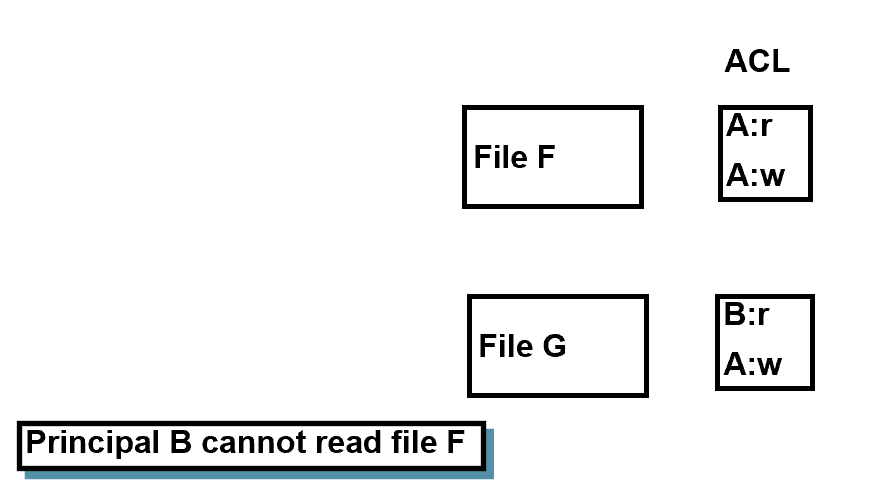

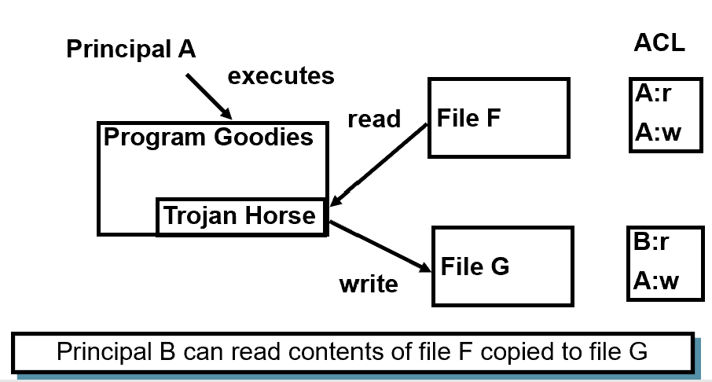

- Principal B can read contents of file F copied to file G

### Buggy Software Can Become Trojan Horse

- When a buggy software is exploited, it execute the code/intention of the attacker, while using the privileges of the user who started it.
- This means that computers with only DAC cannot be trusted to process information classified at different levels
    - Mandatory Access Control is developed to address this problem
    - We will cover this in the next topic

## DAC’s Weaknesses Caused by The Gap 

- A request:  a **subject** wants to perform an action
    - E.g., processes in OS
- The policy:  each **principal** has a set of privileges
    - E.g., user accounts in OS
- Challenging to fill the gap between the subjects and the principals
    - relate the subject to the principals

:::tip
We summarize the above analysis.
On one hand, in the request, a subject wants to perform an action.
On the other hand, in the policy, the privileges are granted to principals.
In order to decide whether to allow or deny the request, we have to fill the gap between the subject in the request and the principals in the policy. In particular, we need to relate the subject to the principals, so that we can determine whether the subject has the privilege to perform the action based on the policy.
:::

## Unix DAC Revisited (1)

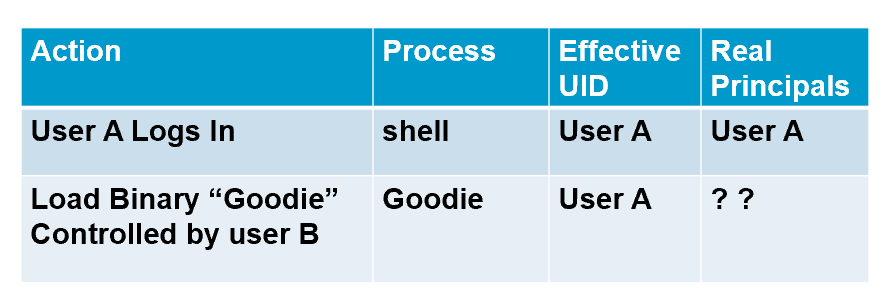

- When the Goodie process issues a request, what principal(s) is/are responsible for the request?
- Under what assumption, it is correct to say that User A is responsible for the request?
- **Assumption: Programs are benign, i.e., they only do what they are told to do.**

:::tip
Both User A and User B 
:::

## UNIX DAC Revisited (2)

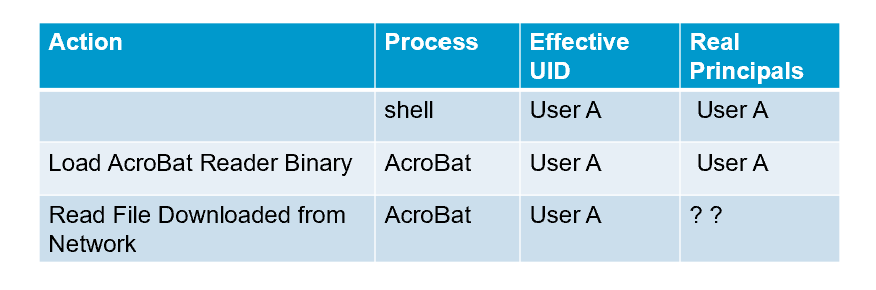

- When the AcroBat process (after reading the file) issues a request, which principal(s) is/are responsible for the request?
- Under what assumption, it is correct to say that User A is responsible for the request?
- **Assumption: Programs are correct, i.e., they handle inputs correctly.**

## Why DAC is vulnerable?

- Implicit assumptions
    - Software are benign, i.e., behave as intended
    - Software are correct, i.e., bug-free
- The reality
    - Malware are popular
    - Software are vulnerable
- The problem is not caused by the discretionary nature of policy specification!
    - i.e., owners can set policies for files

:::tip
Based on the above analysis, by identifying the origin to be the program invoker, DAC actually makes two implicit assumptions.
First, it assumes all software are benign. All software are functional as intended without performing any malicious activities. 
Second, it assumes software are correct. In particular, the input-provider cannot inject malicious code into the program.
However, these assumptions do not hold in the real-world. The reality is malware are popular and software are commonly vulnerable.
:::

- A deeper reason in the enforcement mechanism
    - **A single invoker** is not enough to capture the origins of a process
- When the program is a Trojan
    - The **program-provider** should be responsible for the requests
- When the program is vulnerable
    - It may be exploited by input-providers
    - The requests may be issued by injected code from input-providers
- Solution: include input-providers as the principals

:::tip
The fundamental reason that makes DAC vulnerable is because a single invoker is not enough to capture the origin of a process.
When the program is a Trojan horse, the program-provider should be responsible for the requests issue by the program.
When the program contains bugs, it may be exploited by the input-providers. The requests may be issued by injected code from the input providers.
To fix the weakness in DAC, we need to consider the program-provider and input-providers when identifying the origins.
:::