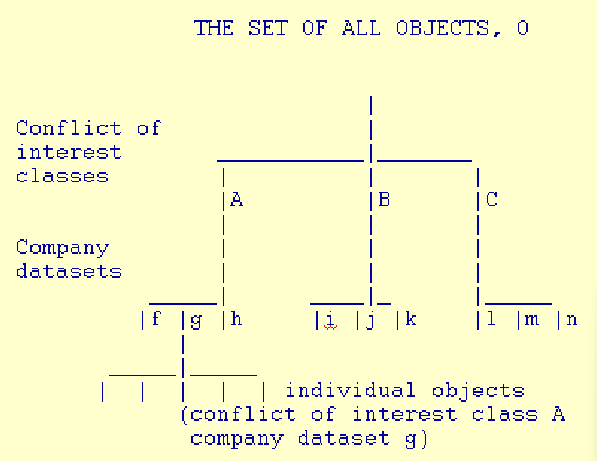

# 完整性保护模型(Integrity Protection Models)

## 阅读材料（也可以看看...）

- 相关论文（可选的）：
    - Kenneth J. Biba: "Integrity Considerations for Secure Computer Systems", MTR-3153, The Mitre Corporation, April 1977.
    - David D. Clark and David R. Wilson. “A Comparison of Commercial and Military Computer Security Policies.” In IEEE SSP 1987.
    - David FC. Brewer and Michael J. Nash. “The Chinese Wall Security Policy.” in IEEE SSP 1989.

## 动机

- BLP([Bell–LaPadula模型](https://zh.wikipedia.org/wiki/Bell%E2%80%93LaPadula%E6%A8%A1%E5%9E%8B))关注的是保密性(confidentiality)
- 在大多数系统中，完整性与保密性同样、甚至更加重要
- 数据完整性与系统完整性
    - 数据完整性意味着数据不能在不被发现的情况下被改变

:::tip
在Bell-LaPadula模型中，用户只能在其自己的安全级别或更高的安全级别上创建内容（例如，秘密研究人员可以创建秘密或绝密文件，但不能创建公共文件；**不能下写**）。相反，用户只能查看在其自己的安全级别或更低的安全级别的内容（如，秘密研究人员可以查看公共或秘密文件，但不能查看绝密文件；**不能上读**）
:::

## 什么是系统的完整性(integrity)？

- 目标1：关键数据不改变
- 目标2： 关键数据只能以“正确的方式”改变
    - 例如，在数据库中，完整性约束(integrity constraint)被用于保证一致性
- 目标3：关键数据只通过某些“受信任的程序”进行改变
- 目标4：关键数据只按照被授权用户的意图改变

## [Biba模型](https://en.wikipedia.org/wiki/Biba_Model): 完整性等级(Integrity Levels)

- 每个主体（进程）都都有一个完整性等级
- 每个客体都有一个完整性等级
- 完整性等级是具有全序关系的(be totally ordered)
- 完整性等级与保密性保护中的安全等级不同
    - 高度敏感的数据可能具有低完整性
    - 问题：*需要高完整性，但不需要保密性的数据的例子是什么？*

### 严格的完整性政策（与BLP相反）

- 规则：
    - s可以读取o，当且仅当 $i(s) \leq i(o)$，其中， $i(s)$ 表示s（主体）的完整性等级
        - 不能下读
        - 阻止通过被污染的数据进行间接破坏
    - s可以写到o，当且仅当 $i(s) \geq i(o)$
        - 不能上写
        - 阻止直接的恶意修改
        - 固定的完整性等级
        - 没有从低完整性等级客体或主体到高完整性等级客体或主体的信息路径

### 主体的最低水位政策(Low-Water Policy)

- 规则：
    - s总是可以读取o，在其读取 $i(s)\leftarrow \min[i(s), i(o)]$ 之后
    - s可以写到o，当且仅当如果 $i(s)\geq i(o)$
- 主体的完整性等级随着阅读低完整性数据而降低
- **没有从低完整性等级的客体到到高完整性等级的客体的信息路径**

### 客体的最低水位线政策(Low-Water Mark Policy)

- 规则：
    - s可以读取o；当且仅当 $i(s) \leq i(o)$
    - s总是可以写到o；写完后 $i(o)\leftarrow \min[i(s), i(o)]$
- 客体的完整性等级随着它被主体污染而降低
- 最后，具有高完整性等级的标签的客体可以保证一定没有被污染

### 最低水位线完整性审计政策(Low-Water Mark Integrity Audit Policy)

- 规则：
    - s总是可以读取o；在读取 $i(s)\leftarrow \min[i(s), i(o)]$ 之后
    - s总是可以写到o；在写完 $i(o)\leftarrow min[i(s), i(o)]$ 之后
- 保证能够对数据的完整性进行追踪，但不能防止污染
- 类似于软件安全中的污点(tainting)概念

### 环策略(The Ring Policy)

- 规则：
    - 任何主体可以读取任何客体
    - 如果 $i(s)\geq i(o)$，则s可以写到o。
- 主体和客体的完整性等级是固定的
- 直觉上：
    - 主体被信任为能够正确处理低完整性级别的输入

### Biba模型的五个强制性政策

- 严格的完整性政策(Strict integrity policy)
- 主体的最低水位政策(Low-Water Policy)
- 客体的最低水位线政策(Low-Water Mark Policy)
- 最低水位线完整性审计政策(Low-Water Mark Integrity Audit Policy)
- 环策略(The Ring Policy)
- 在实践中，人们可能会使用这些政策中的一个或多个，可能对不同的主体应用不同的政策
    - 例如，被应用环形策略的主体被信任为能够正确处理输入

:::tip
Biba模型不关心安全级别和机密性。Biba模型用完整性级别来防止数据从任何完整性级别流到较高的完整性级别中。**信息在系统中只能自上而下流动**。
:::

## 客体的完整性等级
- 一个客体的完整性等级可能被决定于：
    - **信息的质量**（在这方面考量的完整性等级可能会改变）
        - 值得信赖的程度
        - 被污染程度
    - **客体的重要性**（在这方面考量的完整性等级不会改变）
        - 被信任的程度
        - 受保护水平：对客体的写入应受到保护
- 问题：*这两点之间应该是什么关系，哪一个应该更高？*

:::tip
**对问题的回答**（*AI生成*）：

质量和重要性这两个含义之间的关系可能会因系统或组织的背景和具体要求而有所不同。然而，一般来说，一个客体的重要性往往被认为是比其质量更优先的。

一个客体的重要性由其在实现系统或组织的目标和目的方面的重要性决定。它反映了客体的关键性和它对系统的整体运作或成功的影响。被认为是重要的客体通常需要更高水平的保护和限制访问，因为对这些客体的未经授权的修改或访问会产生严重的后果。

另一方面，信息的质量是指客体内容的可信度和可靠性。它包含了信息的准确性、完整性、一致性和有效性等因素。虽然保持高质量的信息是至关重要的，但它通常被认为是确保重要客体的完整性和可靠性的一种手段。

在大多数情况下，一个客体的重要性优先于其质量，因为保护和保持重要客体的完整性对系统的整体安全和稳定至关重要。然而，在重要性和质量之间取得平衡是很重要的，因为这两个因素都有助于系统内客体的整体完整性。因此，在定义客体的完整性等级和相关保护措施时，一个全面的方法需要同时考虑这两个方面。
:::

## 受信任(Trusted)的与值得信任的(Trustworthy)

- 一个系统的一个组件是受信任的，意味着 
    - 系统的安全取决于它
    - 组件的失败会破坏安全策略
    - 由它在系统中的作用决定
- 一个组件是值得信任的的意味着
    - 该组件值得被信任
    - 例如，它的实现是正确的
    - 由组件的内在属性决定

## 完整性(Integrity)与保密性(Confidentiality)

| 保密性 | 完整性 |
| :---: | :---: |
| 读控制：如果机密信息不被读取，就能保存下来 | 写控制：如果重要客体不被改变，就能保存下来
| 对于需要读权限的主体，控制其读之后的写就可以了，不需要信任他们 | 对于需要写权限的主体，必须信任他们，控制读后的写是**不**充分的

完整性需要对主体的信任!

:::tip
**Q**：如何理解完整性保护中，对于需要写权限的主体，必须信任他们，控制读后的写是**不**充分的？

**A**（*AI生成*）：

“对于需要写的主体，必须信任他们，在写之前控制阅读是不够的”这句话表明，在完整性保护的背景下，仅仅控制或限制主体（用户或进程）在写客体之前阅读或访问它们的能力是不够的。相反，需要对这些主体给予额外的信任。

完整性保护机制旨在确保存储在客体中的信息或数据不被改变并保持其预期的完整性。这涉及到控制对客体的访问，只允许授权主体修改或写入客体。

然而，这句话意味着需要对被授权写入客体的主体进行信任。仅仅控制他们在写之前读取客体的能力是不够的，因为它没有解决主体本身的可信度或可靠性问题。

为了确保完整性保护，拥有向客体写入权限的主体应该是可信的实体。信任可以通过各种方式建立，如认证、授权和用户管理实践。它涉及验证主体的身份和合法性，评估他们的权限或许可级别，并确保他们遵守既定的安全政策和准则。

总之，这个陈述强调，除了在写入前控制阅读权限外，重要的是对被授予修改或写入客体权限的主体的信任。值得信任的主体通过确保只对客体进行授权和可靠的修改来帮助维护系统的完整性。
:::

### 一个类比

- 违反保密性：泄露秘密
    - 即使我把秘密告诉一个我不信任的人，也可以防止进一步泄漏，只要我在事后能把这个人关起来
- 违反完整性：遵循错误的指令
    - 如果我听从了一个我不信任的人的指示，即使我事先把这个人锁起，我也能不能防止他收到任何恶意的指示
        - 这个人可以发明恶意的指令而不需要外界的输入

### 保密性和完整性的主要区别

- 对于保密性来说，控制读和写就足够了
    - 理论上说，对于保密性来说，不需要信任任何主体；但是，在Bell–LaPadula模型中确实需要信任的主体来使系统现实化。
- 对于完整性来说，控制读和写是不够的
    - 人们必须信任所有可以写入关键数据的主体

#### 需要信任主体的影响

- 只信任一个小的安全内核已不可能了
- 不需要担心完整性保护的隐蔽信道(covert channel)
- 如何建立对主体的信任成为一个挑战

## 完整性保护的应用

- Windows系统中的强制完整性控制（自Windows Vista起）
    - 使用四个完整性等级：低(Low)、中(Medium)、高(High)和系统(System)
    - 每个进程都被分配了一个完整性等级，这限制了它可以访问的资源
    - 由普通用户启动的进程为中完整性等级
    - 被提权的进程具有高完整性等级
- 通过用户帐户控制进程的特性
    - 一些进程以低级运行，如保护模式下的IE。
    - 读和写不会改变完整性级别
        - 环策略

## 克拉克-威尔逊模型([The Clark-Wilson Model](https://en.wikipedia.org/wiki/Clark%E2%80%93Wilson_model))

- David D. Clark和David R. Wilson “商业和军事计算机安全政策的比较(A Comparison of Commercial and Military Computer Security Policies.)” 发表于IEEE SSP 1987
    - 军事政策的重点是防止泄露
    - 在商业环境中，完整性是最重要的
- 系统的任何用户，即使得到授权，也不允许修改数据项目，以至于公司的资产或会计记录丢失或被破坏

### 两个执行数据完整性的高层次机制

- **良型**事物(well-formed transaction)
    - 用户不应任意操作数据，而只能以受限的方式保存或确保数据完整性
        - 例如，使用仅有附录的日志来记录所有交易
        - 例如，复式记账法
        - 例如，passwd
    - **只能通过受信任的代码操作数据！**
- **职责分离**
    - 确保外部一致性：数据客体与现实世界的对象相对应 
    - 将所有操作分成几个子部分，并要求每个子部分由不同的人执行
    - 例如，两人规则(the two-man rule)

#### 两个高层次机制的实现

- 需要有机制来确保
    - **控制对数据的访问**：一个数据项只能由一组特定的程序来操作
    - **程序认证**：必须检查程序的正确编写，必须对安装和修改这些程序的能力加以控制
    - **控制对程序的访问**：每个用户必须被允许只使用某些程序集
    - **控制管理**：必须控制和检查人员对程序的分配

### 克拉克-威尔逊完整性模型(The Clarke-Wilson Model for Integrity)

- 不受约束的数据项（Unconstrained Data Items, abbr. UDIs）
    - 完整性低的数据
- 受限数据项（Constrained Data Items, abbr. CDIs）
    - 完整性模型必须适用于系统内的数据项
- 完整性验证程序（Integrity Verification Procedures, abbr. IVPs）
    - 确认系统中所有的受限数据项都符合完整性规范。
- 转换程序（Transformation Procedures, abbr. TPs）
    - 良形事务

### 与MAC或BLP的区别

- 一个数据项不与一个特定的安全级别相关联，而是与一组TP相关联
- 用户没有被赋予对数据项的读/写权限，而是被赋予执行某些程序的权限。

### 与Biba模型的比较

- Biba模型缺乏关于识别受信任主体的程序和要求
- Clark-Wilson模型关注的是如何确保程序可以被信任

## “[中国墙](https://zh.wikipedia.org/wiki/%E4%B8%AD%E5%9B%BD%E5%A2%99)”(Chinese Wall)安全政策

- 目标：**避免利益冲突**
- 数据被存储在一个分层排列的系统中
    - 最底层由单个数据项组成
    - 中间层的数据项目被分组为公司数据集
    - 最高级别的公司数据集，它们的合作存在竞争关系
- 是一种约束利益冲突的成员对文件读/写访问资格的安全模型

### 中国墙政策中的简单安全规则

- 只有当请求的客体被授予访问权：
    - 与该主体已经访问的客体在同一公司的数据集中（即在长城内），或者：
    - 属于一个完全不同的利益冲突类别